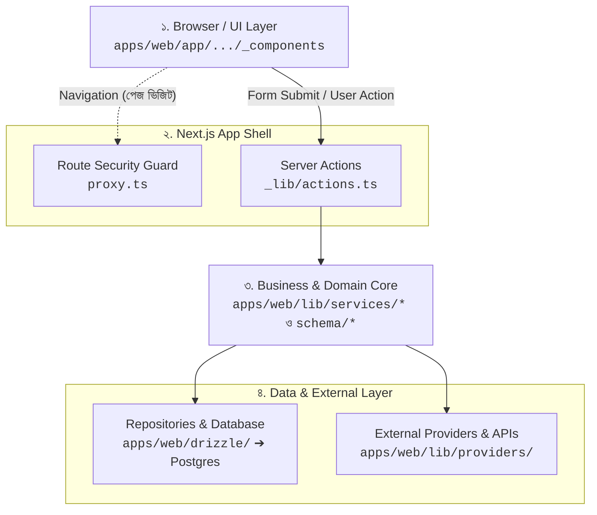
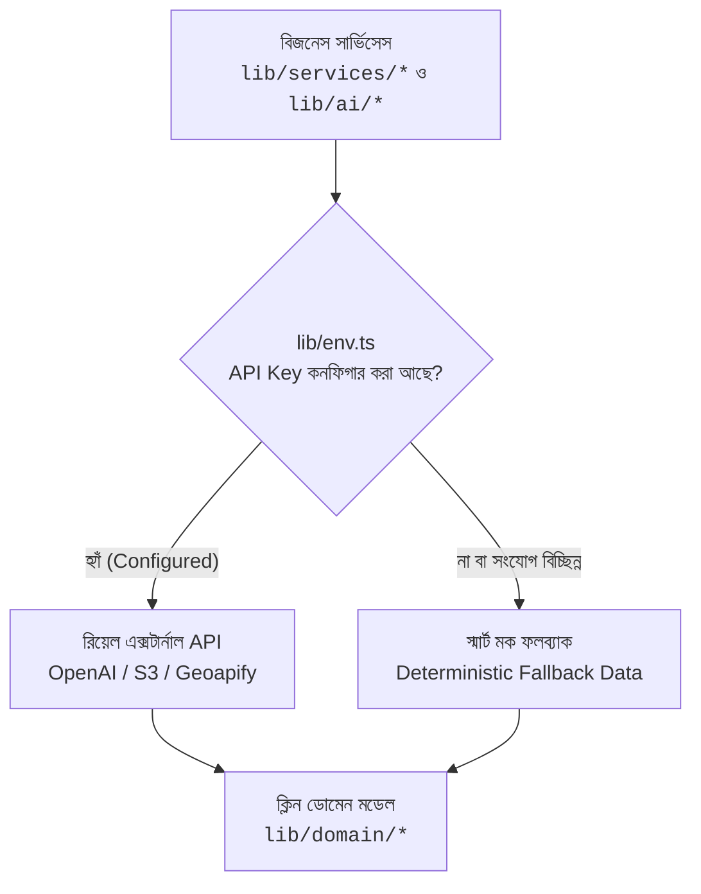

# 🧭 Todo App Playbook: সম্পূর্ণ প্রজেক্টের বিগিনার লার্নিং গাইড (Beginner → Intermediate → Advanced)

স্বাগতম! এই প্লেবুকটি আমাদের **Todo Application** কোডবেসের প্রতিটি অংশের বাস্তব কার্যপদ্ধতি, ডাটা ফ্লো এবং আর্কিটেকচার অত্যন্ত সহজবোধ্য ও শিক্ষণীয় বাংলা ভাষায় ব্যাখ্যা করার জন্য তৈরি করা হয়েছে।

একজন নতুন ডেভেলপার যেন প্রজেক্টের যেকোনো কোড দেখে বুঝতে পারেন:
- **কোডটি কোথায় আছে এবং কেন সেখানে রাখা হয়েছে**
- **ফাংশনটি কোথা থেকে কল হচ্ছে, কী ইনপুট নিচ্ছে এবং কী আউটপুট দিচ্ছে**
- **ভবিষ্যতে নতুন কোনো ফিচার বা UI যোগ করতে হলে কোন কোন ফোল্ডার ও ফাইলে হাত দিতে হবে**

---

## 🏗️ মূল আর্কিটেকচারাল ফ্লো (The 10-Step Flow)

আমাদের পুরো সিস্টেমে যেকোনো কাজ নিচের ১০টি সুশৃঙ্খল ধাপ অনুসরণ করে সম্পন্ন হয়:

```
[1. Requirement] ──► [2. Design & ADR] ──► [3. Route & Page] ──► [4. Schema (Zod)]
                                                                           │
┌──────────────────────────────────────────────────────────────────────────┘
▼
[5. Action (Server)] ──► [6. Service (Logic)] ──► [7. Repository] ──► [8. Database]
                                                                           │
┌──────────────────────────────────────────────────────────────────────────┘
▼
[9. Test (Vitest)] ──► [10. Review & Deploy]
```

---

## 📊 ভিজ্যুয়াল আর্কিটেকচার ডায়াগ্রামসমূহ (Visual Architecture Diagrams)

সহজে ও পরিষ্কারভাবে পুরো সিস্টেম বোঝার জন্য নিচে ৩টি ফোকাসড Mermaid ডায়াগ্রাম দেওয়া হলো:

### ১. High-Level Architecture (মূল লেয়ারসমূহের সামগ্রিক স্তর)



> **ব্যাখ্যা:**  
> - **Browser/UI Layer:** ইউজার ব্রাউজারে ইন্টারঅ্যাক্ট করেন। পেজ পরিবর্তনের সময় `proxy.ts` রুট গার্ড সেশন যাচাই করে।
> - **Next.js App Shell:** ব্যবহারকারীর ফর্ম সাবমিশনগুলো সার্ভার অ্যাকশনে আসে।
> - **Business/Domain Core:** ইনপুট ভ্যালিডেশন এবং মূল বিজনেস লজিক প্রক্রিয়াজাত করে।
> - **Data & External Providers:** ডেটাবেস অপারেশন এবং থার্ড-পার্টি API (OpenAI, S3, Maps) কলগুলো হ্যান্ডেল করে।

---

### ২. Todo Request Flow (রিকোয়েস্ট ও ডেটা প্রবাহের পূর্ণাঙ্গ চক্র)

```mermaid
flowchart LR
    UI["UI Component<br/><code>TodoForm.tsx</code>"]
    Action["Server Action<br/><code>actions.ts</code>"]
    Zod["Zod Validation<br/><code>schema/todo.ts</code>"]
    Auth["Auth Check<br/><code>requireUserId()</code>"]
    Service["Domain Service<br/><code>todo.service.ts</code>"]
    Repo["Repository<br/><code>todo.repository.ts</code>"]
    DB[("PostgreSQL<br/><code>todos table</code>")]

    UI -->|"১. Submit"| Action
    Action -->|"২. Validate"| Zod
    Zod -->|"৩. Verify Session"| Auth
    Auth -->|"৪. Business Logic"| Service
    Service -->|"৫. SQL Query"| Repo
    Repo -->|"৬. INSERT / UPDATE"| DB
```



> **ব্যাখ্যা:**  
> ১. ইউজার ফর্ম সাবমিট করলে Server Action কল হয়।  
> ২. Zod স্কিমা ইনপুটের আকার ও টাইপ যাচাই করে।  
> ৩. `requireUserId()` সেশন থেকে ইউজারের পরিচয় নিশ্চিত করে।  
> ৪. Domain Service বিজনেস লজিক ও ডেটা রূপান্তর পরিচালনা করে।  
> ৫. Repository কুয়েরিতে ইউজারের `userId` বাধ্যতামূলকভাবে ফিল্টার করে PostgreSQL ডাটাবেসে সেভ করে।

---

### ৩. External Provider Flow (এক্সটার্নাল সার্ভিস ও স্মার্ট ফলব্যাক)



> **ব্যাখ্যা:**  
> কোনো সার্ভিসে থার্ড-পার্টি API প্রয়োজন হলে প্রথমে `lib/env.ts` চেক করে। API Key অনুপস্থিত বা নেটওয়ার্ক ফেইল করলেও অ্যাপ কখনো ক্র্যাশ করে না; বরং বুদ্ধিমান মক ডেটা দিয়ে ফ্রন্টএন্ডে ক্লিন ডোমেন মডেল রিটার্ন করে।

---

# 📚 পর্ব ১: ১০টি ধাপের পুঙ্খানুপুঙ্খ ব্যাখ্যা (Deep-Dive)

---

## ধাপ ১: Requirement (চাহিদা ও আবশ্যকতা নির্ধারণ)

যেকোনো কোড লেখার আগে সিস্টেমের ফাংশনাল ও নন-ফাংশনাল চাহিদা স্পষ্ট থাকতে হয়।

- **ব্যবহৃত ফাইল:**
  - [functional-requirements.md](file:///c:/Users/Tplus_staff/Desktop/Todo-App/todo-project/docs/requirements/functional-requirements.md) (FR-01 থেকে FR-07)
  - [non-functional-requirements.md](file:///c:/Users/Tplus_staff/Desktop/Todo-App/todo-project/docs/requirements/non-functional-requirements.md) (NFR-01 থেকে NFR-04)
- **ফাইলের দায়িত্ব:** অ্যাপ্লিকেশনে ইউজার কী কী করতে পারবেন (লগইন, টুডু তৈরি, AI সাজেশন, ছবি আপলোড, PASETO শেয়ারিং) এবং সিস্টেমের গতি ও নিরাপত্তার মানদণ্ড নথিভুক্ত রাখা।
- **ফ্লো:** এখান থেকে ঠিক হয় আমরা পরবর্তী ধাপে কোন ফিচার ডিজাইন করব।

---

## ধাপ ২: Design & Architectural Decisions (ADR)

- **ব্যবহৃত ফোল্ডার ও ফাইলসমূহ:**
  - `docs/adr/` — [001-monorepo-structure.md](file:///c:/Users/Tplus_staff/Desktop/Todo-App/todo-project/docs/adr/001-monorepo-structure.md) থেকে [005-database-and-drizzle.md](file:///c:/Users/Tplus_staff/Desktop/Todo-App/todo-project/docs/adr/005-database-and-drizzle.md)
  - `docs/design/` — [architecture-overview.md](file:///c:/Users/Tplus_staff/Desktop/Todo-App/todo-project/docs/design/architecture-overview.md), [system-flow.md](file:///c:/Users/Tplus_staff/Desktop/Todo-App/todo-project/docs/design/system-flow.md)
- **দায়িত্ব ও নিয়ম:**
  - **৪-লেয়ার্ড প্যাটার্ন:** UI → Server Action → Domain Service → Repository → Database।
  - **রুট-লোকাল নিয়ম:** কোনো ফিচারের UI বা Server Action শুধু সেই রুটের ফোল্ডারে থাকবে (`_components/` ও `_lib/`), গ্লোবাল ফোল্ডার নষ্ট করা যাবে না।
  - **জিরো-ক্র্যাশ ও ফলব্যাক নীতি:** ইন্টারনেট বা API কি না থাকলেও অ্যাপ ক্র্যাশ না করে ডামি ডেটা দিয়ে সচল থাকবে।

---

## ধাপ ৩: Route, Page & UI Layer (রুট ও ইউজার ইন্টারফেস)

ব্যবহারকারী ব্রাউজারে যে পেজ দেখেন এবং ফর্ম পূরণ করেন।

- **ব্যবহৃত ফোল্ডার ও ফাইলসমূহ:**
  - **রুট গার্ড:** [proxy.ts](file:///c:/Users/Tplus_staff/Desktop/Todo-App/todo-project/apps/web/proxy.ts)
  - **সার্ভার পেজ:** [todos/page.tsx](file:///c:/Users/Tplus_staff/Desktop/Todo-App/todo-project/apps/web/app/%28dashboard%29/todos/page.tsx)
  - **ক্লায়েন্ট কম্পোনেন্টস:**
    - [TodoForm.tsx](file:///c:/Users/Tplus_staff/Desktop/Todo-App/todo-project/apps/web/app/%28dashboard%29/todos/_components/TodoForm.tsx) (নতুন টুডু ইনপুট ও সাবমিট ফর্ম)
    - [TodoList.tsx](file:///c:/Users/Tplus_staff/Desktop/Todo-App/todo-project/apps/web/app/%28dashboard%29/todos/_components/TodoList.tsx) (টুডু তালিকা রেন্ডার)
    - [TodoItem.tsx](file:///c:/Users/Tplus_staff/Desktop/Todo-App/todo-project/apps/web/app/%28dashboard%29/todos/_components/TodoItem.tsx) (একক টুডু কার্ড, কমপ্লিট চেকবক্স, ডিলিট ও শেয়ার বাটন)
    - [TodoFilters.tsx](file:///c:/Users/Tplus_staff/Desktop/Todo-App/todo-project/apps/web/app/%28dashboard%29/todos/_components/TodoFilters.tsx) (সার্চ ও স্ট্যাটাস ফিল্টার বার)
- **কেন এখানে রাখা হয়েছে:** Next.js App Router-এ `(dashboard)/todos` এর নিজস্ব কম্পোনেন্টগুলো `_components` ফোল্ডারে রাখলে কোড অত্যন্ত গোছানো থাকে।

### গুরুত্বপূর্ণ অংশ ও কোডের ব্যাখ্যা:
```typescript
// apps/web/proxy.ts
// ব্যবহারকারী লগইন ছাড়া /todos পেজে ঢোকার চেষ্টা করলে সাথে সাথে /login পেজে পাঠায়
export function proxy(request: NextRequest) {
  const sessionCookie = getSessionCookie(request);
  if (!sessionCookie) {
    return NextResponse.redirect(new URL("/login", request.url));
  }
  return NextResponse.next();
}
```

```typescript
// apps/web/app/(dashboard)/todos/page.tsx
// সার্ভার কম্পোনেন্ট: সার্ভারেই ডাটাবেস থেকে প্রাথমিক টুডু লিস্ট ফেচ করে ক্লায়েন্টে পাঠায়
const TodosPage = async ({ searchParams }: PageProps<"/todos">) => {
  const session = await getOptionalSession();
  const params = await searchParams;
  const query = todoQuerySchema.parse(params);

  // সার্ভিস থেকে ইউজারের নিজস্ব টুডু আনা হচ্ছে
  const initialTodos = session
    ? await todoService.listForUser(session.user.id, query)
    : [];

  return <Todo initialTodos={initialTodos} />;
};
```

- **ইনপুট ও আউটপুট:**
  - `page.tsx` ইনপুট হিসেবে URL-এর `searchParams` নেয় এবং আউটপুট হিসেবে HTML + `initialTodos` ডেটা পাঠায়।
- **ফ্লো:** `proxy.ts` গার্ড পার হয়ে `page.tsx` লোড হয় → ইউজার UI-তে কিছু টাইপ করে সাবমিট করলে তা `TodoForm` থেকে সরাসরি সার্ভার অ্যাকশনে যায়।

---

## ধাপ ৪: Schema & Validation Layer (Zod ইনপুট ভ্যালিডেশন)

ডাটাবেসে কোনো ভুল বা ক্ষতিকর ডেটা যেন না ঢুকতে পারে, তার একক সত্যের উৎস (Single Source of Truth)।

- **ব্যবহৃত ফোল্ডার ও ফাইলসমূহ:**
  - [schema/todo.ts](file:///c:/Users/Tplus_staff/Desktop/Todo-App/todo-project/apps/web/schema/todo.ts) — টুডু সংক্রান্ত Zod স্কিমা
  - [schema/auth.ts](file:///c:/Users/Tplus_staff/Desktop/Todo-App/todo-project/apps/web/schema/auth.ts) — লগইন, রেজিস্ট্রেশন ও পাসওয়ার্ড স্কিমা
  - [schema/ai.ts](file:///c:/Users/Tplus_staff/Desktop/Todo-App/todo-project/apps/web/schema/ai.ts) — AI প্রম্পট স্কিমা
  - [schema/place.ts](file:///c:/Users/Tplus_staff/Desktop/Todo-App/todo-project/apps/web/schema/place.ts) — লোকেশন স্কিমা
- **কেন এখানে রাখা হয়েছে:** ক্লায়েন্ট ও সার্ভার উভয় স্থানে একই স্কিমা শেয়ার করার জন্য `apps/web/schema/` ফোল্ডারে রাখা হয়েছে।

### গুরুত্বপূর্ণ স্কিমাসমূহ এবং তাদের ব্যাখ্যা:
```typescript
// apps/web/schema/todo.ts

// ১. আইডি ভ্যালিডেশন: নিশ্চিত করে এটি একটি সঠিক UUID
export const todoIdSchema = z.string().uuid("Invalid todo id");

// ২. টুডু তৈরির ইনপুট স্কিমা
export const createTodoSchema = z.object({
  // টাইটেল খালি থাকা চলবে না, অপ্রয়োজনীয় স্পেস ট্রিম হবে, সর্বোচ্চ ২০০ অক্ষর
  title: z.string().trim().min(1, "Title is required").max(200, "Title is too long"),
  // বিবরণ ঐচ্ছিক, সর্বোচ্চ ২০০০ অক্ষর; খালি স্ট্রিং থাকলে undefined বানাবে
  body: z
    .string()
    .trim()
    .max(2000, "Details are too long")
    .optional()
    .transform((value) => (value ? value : undefined)),
});

// ৩. সার্চ ও ফিল্টার কুয়েরি স্কিমা
export const todoQuerySchema = z.object({
  search: z.string().trim().max(200).optional().transform((v) => (v ? v : undefined)),
  // স্ট্যাটাস অবশ্যই "all", "active" বা "completed" হতে হবে
  status: z.enum(["all", "active", "completed"]).catch("all"),
});
```

- **ইনপুট ও আউটপুট:**
  - ইনপুট: ক্লায়েন্ট থেকে আসা যেকোনো জাভাস্ক্রিপ্ট অবজেক্ট `{ title, body }`।
  - আউটপুট: টাইপ-সেফ ও ক্লিন ডেটা অথবা ভ্যালিডেশন এরর থ্রো করে।

---

## ধাপ ৫: Server Action Layer (অ্যাকশন ও অর্কেস্ট্রেশন)

Next.js Server Actions হলো সার্ভারে চলা অ্যাসিনক্রোনাস ফাংশন, যা ফ্রন্টএন্ড ফর্ম থেকে সরাসরি কল করা যায়।

- **ব্যবহৃত ফাইল:**
  - [actions.ts](file:///c:/Users/Tplus_staff/Desktop/Todo-App/todo-project/apps/web/app/%28dashboard%29/todos/_lib/actions.ts)
  - [place.actions.ts](file:///c:/Users/Tplus_staff/Desktop/Todo-App/todo-project/apps/web/app/%28dashboard%29/todos/_lib/place.actions.ts)
- **দায়িত্ব:** এটি অত্যন্ত পাতলা (Thin) একটি লেয়ার। এর ৪টি নির্দিষ্ট কাজ:
  1. `requireUserId()` দিয়ে ইউজার সেশন চেক করা।
  2. `Zod Schema.parse()` দিয়ে ইনপুট যাচাই করা।
  3. উপযুক্ত ডোমেন সার্ভিসকে কল করা।
  4. `revalidatePath("/todos")` কল করে ক্যাশ রিফ্রেশ করা।

### প্রধান অ্যাকশন ফাংশনসমূহের বিস্তারিত বিশ্লেষণ:

#### ১. `createTodo(input)`
```typescript
export async function createTodo(input: { title: string; body?: string }) {
  const userId = await requireUserId();        // ১. সেশন থেকে ইউজার আইডি বের করে
  const data = createTodoSchema.parse(input);  // ২. Zod দিয়ে টাইটেল ও বডি ভ্যালিডেট করে

  const newTodo = await todoService.create(userId, data); // ৩. সার্ভিসের মাধ্যমে তৈরি করে

  revalidatePath("/todos");                   // ৪. পেজ ইনস্ট্যান্ট রিফ্রেশ করে
  return newTodo;
}
```
- **কোথা থেকে কল হয়:** `TodoForm.tsx` থেকে যখন ইউজার "Add Task" চাপেন।
- **ইনপুট:** `{ title: "বাজার করা", body: "চাল, ডাল" }`
- **আউটপুট:** নতুন তৈরি হওয়া `TodoType` অবজেক্ট।

#### ২. `toggleTodo(id)`
```typescript
export async function toggleTodo(id: string) {
  const userId = await requireUserId();
  todoIdSchema.parse(id);                     // UUID কিনা যাচাই করে

  const completed = await todoService.toggle(userId, id);

  revalidatePath("/todos");
  return completed;
}
```
- **কোথা থেকে কল হয়:** `TodoItem.tsx`-এর চেকবক্সে ক্লিক করলে।
- **ইনপুট:** `id: "c8b4..."`
- **আউটপুট:** বুলিয়ান `true` বা `false`।

#### ৩. `updateTodo(id, input)`
```typescript
export async function updateTodo(id: string, input: { title: string; body?: string }) {
  const userId = await requireUserId();
  todoIdSchema.parse(id);
  const data = updateTodoSchema.parse(input);

  const updated = await todoService.update(userId, id, data);
  revalidatePath("/todos");
  return updated;
}
```
- **কোথা থেকে কল হয়:** `TodoItem.tsx`-এর এডিট মোডাল সাবমিট করলে।

#### ৪. `deleteTodo(id)`
```typescript
export async function deleteTodo(id: string) {
  const userId = await requireUserId();
  todoIdSchema.parse(id);

  await todoService.remove(userId, id);
  revalidatePath("/todos");
}
```
- **কোথা থেকে কল হয়:** `TodoItem.tsx`-এর ট্র্যাশ বিন আইকনে ক্লিক করে নিশ্চিত করলে।

#### ৫. `generateSuggestions(prompt)`
```typescript
export async function generateSuggestions(prompt: string) {
  await requireUserId();
  const validPrompt = aiPromptSchema.parse(prompt);
  return aiService.generateTodoSuggestions(validPrompt);
}
```
- **কোথা থেকে কল হয়:** `TodoForm.tsx`-এর Sparkle (✨) AI বাটনে ক্লিক করলে।
- **ইনপুট:** `"অফিস প্রেজেন্টেশন"`
- **আউটপুট:** ৩টি সাজেস্টেড কাজের অ্যারে `[{ title, body }]`।

#### ৬. `createShareLink(id)`
```typescript
export async function createShareLink(id: string) {
  const userId = await requireUserId();
  todoIdSchema.parse(id);

  const token = await shareService.createShareLink(userId, id);
  return `${getEnv().BETTER_AUTH_URL}/share/${token}`;
}
```
- **কোথা থেকে কল হয়:** `TodoItem.tsx`-এর "Share" বাটনে চাপ দিলে।
- **আউটপুট:** ক্রিপ্টোগ্রাফিক পাবলিক শেয়ার লিংক।

---

## ধাপ ৬: Service & Domain Layer (বিজনেস লজিক ও স্যানিটাইজেশন)

- **ব্যবহৃত ফোল্ডার ও ফাইলসমূহ:**
  - [todo.service.ts](file:///c:/Users/Tplus_staff/Desktop/Todo-App/todo-project/apps/web/lib/services/todo.service.ts)
  - [share.service.ts](file:///c:/Users/Tplus_staff/Desktop/Todo-App/todo-project/apps/web/lib/services/share.service.ts)
  - [upload.service.ts](file:///c:/Users/Tplus_staff/Desktop/Todo-App/todo-project/apps/web/lib/services/upload.service.ts)
  - [place.service.ts](file:///c:/Users/Tplus_staff/Desktop/Todo-App/todo-project/apps/web/lib/services/place.service.ts)
  - [lib/domain/todo.ts](file:///c:/Users/Tplus_staff/Desktop/Todo-App/todo-project/apps/web/lib/domain/todo.ts)
  - [lib/auth/session.ts](file:///c:/Users/Tplus_staff/Desktop/Todo-App/todo-project/apps/web/lib/auth/session.ts)
- **দায়িত্ব:** এটি অ্যাপ্লিকেশনের মূল মস্তিষ্ক। এটি সরাসরি ডাটাবেস কোয়েরি করে না; বরং রিপোজিটরিকে নির্দেশ দেয় এবং ডাটাবেস থেকে পাওয়া `null` যুক্ত কাঁচা রো-কে ফ্রন্টএন্ড-বান্ধব ডোমেন মডেলে রূপান্তর করে।

### গুরুত্বপূর্ণ অংশ ও কোডের ব্যাখ্যা:

#### ১. `toTodoType(row)` ট্রান্সফরমার ফাংশন
ডাটাবেসে যেসব ফিল্ড `null` থাকে (যেমন খালি ডেসক্রিপশন বা লোকেশন), জাভাস্ক্রিপ্ট/টাইপস্ক্রিপ্টে সেগুলোকে সুন্দরভাবে `undefined` বা স্ট্রাকচার্ড অবজেক্টে রূপান্তর করে:
```typescript
// apps/web/lib/services/todo.service.ts
function toTodoType(row: RawTodoRow): TodoType {
  return {
    id: row.id,
    title: row.title,
    body: row.body ?? undefined,
    imageUrl: row.imageUrl ?? undefined,
    place:
      row.placeId && row.placeName && row.placeLat != null && row.placeLng != null
        ? { id: row.placeId, name: row.placeName, lat: row.placeLat, lng: row.placeLng }
        : undefined,
    completed: row.completed,
  };
}
```

#### ২. সেশন সিকিউরিটি হেল্পার্স (`lib/auth/session.ts`)
```typescript
// ইউজারের সেশন চেক করে; লগইন না থাকলে সরাসরি Error থ্রো করে
export async function requireSession() {
  const session = await auth.api.getSession({ headers: await headers() });
  if (!session) throw new Error("Not authenticated");
  return session;
}

// সহজে শুধুমাত্র লগইন করা ইউজারের ID পাওয়ার জন্য
export async function requireUserId() {
  const session = await requireSession();
  return session.user.id;
}

// অ্যাডমিন কিনা চেক করার জন্য
export async function isAdmin(): Promise<boolean> {
  const session = await getOptionalSession();
  return session?.user.role === "admin";
}
```

---

## ধাপ ৭: Repository Layer (ডাটাবেস এক্সেস লেয়ার)

- **ব্যবহৃত ফাইল:** [todo.repository.ts](file:///c:/Users/Tplus_staff/Desktop/Todo-App/todo-project/apps/web/drizzle/todo.repository.ts)
- **কঠোর নিয়ম:** পুরো অ্যাপ্লিকেশনে **শুধুমাত্র এই ফাইলটি** Drizzle ORM-এর `db` ক্লায়েন্ট ইমপোর্ট করতে পারে। কোনো UI বা সার্ভিস সরাসরি `db` ছুঁতে পারবে না।
- **দায়িত্ব:** ডাটাবেসে SQL কুয়েরি চালানো এবং প্রতিটা কুয়েরিতে `userId` বাধ্যবাধকতা বজায় রাখা।

### রিপোজিটরির কুয়েরিসমূহ ও ব্যাখ্যা:
```typescript
// apps/web/drizzle/todo.repository.ts
export const todoRepository = {
  // ১. ইউজারের টুডু খোঁজা (সার্চ ও ফিল্টার সহ)
  async findByUserId(userId: string, query?: TodoQuery) {
    const conditions = [eq(todos.userId, userId)]; // 👈 মাল্টি-টেন্যান্ট আইসোলেশন

    if (query?.search) {
      const pattern = `%${query.search}%`;
      conditions.push(or(ilike(todos.title, pattern), ilike(todos.body, pattern))!);
    }
    if (query?.status === "active") conditions.push(eq(todos.completed, false));
    if (query?.status === "completed") conditions.push(eq(todos.completed, true));

    return db.select().from(todos).where(and(...conditions)).orderBy(desc(todos.createdAt));
  },

  // ২. নতুন টুডু ইনসার্ট করা
  async insert(userId: string, data: { title: string; body?: string }) {
    const [row] = await db
      .insert(todos)
      .values({ userId, title: data.title, body: data.body ?? null })
      .returning();
    return row;
  },

  // ৩. টুডুর কমপ্লিট স্ট্যাটাস টগল করা (SQL NOT অপারেশন)
  async toggle(id: string, userId: string) {
    const [row] = await db
      .update(todos)
      .set({ completed: sql`not ${todos.completed}`, updatedAt: new Date() })
      .where(and(eq(todos.id, id), eq(todos.userId, userId))) // 👈 অন্য ইউজারের টুডু টগল করা অসম্ভব
      .returning();
    return row;
  },

  // ৪. টুডু ডিলিট করা
  async remove(id: string, userId: string) {
    await db.delete(todos).where(and(eq(todos.id, id), eq(todos.userId, userId)));
  },
};
```

---

## ধাপ ৮: Database Layer (Postgres + Drizzle Schema)

- **ব্যবহৃত ফাইলসমূহ:**
  - [drizzle/schema.ts](file:///c:/Users/Tplus_staff/Desktop/Todo-App/todo-project/apps/web/drizzle/schema.ts) — টুডু টেবিল স্কিমা
  - [drizzle/auth-schema.ts](file:///c:/Users/Tplus_staff/Desktop/Todo-App/todo-project/apps/web/drizzle/auth-schema.ts) — অথেনটিকেশন টেবিল (`user`, `session`, `account`, `verification`)
  - [drizzle/client.ts](file:///c:/Users/Tplus_staff/Desktop/Todo-App/todo-project/apps/web/drizzle/client.ts) — Neon Postgres ডাটাবেস সংযোগকারী
  - [drizzle.config.ts](file:///c:/Users/Tplus_staff/Desktop/Todo-App/todo-project/apps/web/drizzle.config.ts) — Drizzle Kit কনফিগারেশন

### টেবিল স্কিমা কাঠামো:
```typescript
// apps/web/drizzle/schema.ts
export const todos = pgTable("todos", {
  id: uuid("id").primaryKey().defaultRandom(),
  userId: text("user_id").notNull(),            // 👈 Foreign Key to User
  title: varchar("title", { length: 200 }).notNull(),
  body: text("body"),
  imageUrl: text("image_url"),
  placeId: text("place_id"),
  placeName: text("place_name"),
  placeLat: doublePrecision("place_lat"),
  placeLng: doublePrecision("place_lng"),
  completed: boolean("completed").default(false).notNull(),
  createdAt: timestamp("created_at").defaultNow().notNull(),
  updatedAt: timestamp("updated_at").defaultNow().notNull(),
});
```

---

## ধাপ ৯: Automated Testing (স্বয়ংক্রিয় টেস্টিং)

আমাদের প্রজেক্টে আসল ডাটাবেস চালু না রেখেও কয়েক মিলি-সেকেন্ডে পুরো সিস্টেমের লজিক টেস্ট করা যায়।

- **টেস্ট ফাইল লোকেশন:** `apps/web/tests/`
  - `todo.schema.test.ts` — Zod ভ্যালিডেশনের টেস্ট (খালি টাইটেল, অতিরিক্ত বড় টেক্সট আটকায় কিনা)।
  - `todo.service.test.ts` — সার্ভিস লেয়ারের টেস্ট (রিপোজিটরি মক করে সার্ভিস ঠিকমতো কাজ করছে কিনা)।
  - `TodoForm.test.tsx` — রিঅ্যাক্ট টেস্টিং লাইব্রেরি দিয়ে ফর্ম সাবমিশন টেস্ট।
  - `paseto.test.ts` — টোকেন এনক্রিপশন ও ডিক্রিপশন টেস্ট।

### টেস্ট চালানোর কমান্ড:
```bash
cd apps/web
npm run test          # একবার টেস্ট চালিয়ে রিপোর্ট দেখতে
npm run test:watch    # কোড লেখার সাথে সাথে লাইভ টেস্ট চালাতে
```

---

## ধাপ ১০: Review & Observability (পর্যালোচনা)

কোড পিআর (Pull Request) বা প্রোডাকশনে পাঠানোর আগে চেকলিস্ট:
1. ✅ **টাইপ সেফটি:** কোনো ফাইলে `any` টাইপ আছে কি না? (`npm run check-types`)
2. ✅ **ইউজার আইসোলেশন:** প্রতিটি নতুন রিপোজিটরি মেথডে `userId` বাধ্যতামূলক আছে কি না?
3. ✅ **ফলব্যাক সুরক্ষা:** এক্সটার্নাল এপিআই বন্ধ থাকলে অ্যাপ ক্র্যাশ না করে বিকল্প ডেটা দিচ্ছে কি না?
4. ✅ **টেস্ট স্ট্যাটাস:** সব কয়টি Vitest টেস্ট গ্রিন (Pass) হয়েছে কি না?

---

## ধাপ ১১: স্কেল-উপযোগী গঠন — Over-Engineering এড়িয়ে চলা

এই প্রজেক্টের স্কেলে (একটাই app, ছোট টিম) ফোল্ডার স্ট্রাকচার **flat** রাখাই ডিফল্ট নিয়ম। একটা মাত্র ফাইলের জন্য subfolder তৈরি করা, বা কোনো real caller ছাড়া নতুন layer/wrapper বানানো — দুটোই over-engineering, এবং দুটোই এড়িয়ে চলতে হবে।

**নিয়মগুলো:**
1. **`schema/`, `tests/`, `drizzle/` সবসময় flat।** এক ফাইলের জন্য আলাদা subfolder (যেমন `drizzle/repositories/todo.repository.ts` বা `drizzle/schema/todo.schema.ts`) বানানো হয় না — সরাসরি `drizzle/todo.repository.ts`, `drizzle/schema.ts`।
2. **`lib/paseto.ts` এর মতো ছোট shared ইউটিলিটি `lib/` রুটেই থাকে** — নিজস্ব subfolder পায় না যতক্ষণ না একাধিক related ফাইল জমা হয়।
3. **Real consumer ছাড়া কোনো abstraction/layer/service রাখা হয় না।** উদাহরণ: এই প্রজেক্টে আগে একটা `notification` ফিচার (service + domain type + schema + test) তৈরি হয়েছিল, কিন্তু কোনো UI/route/action সেটা call করত না — তাই পুরোপুরি সরিয়ে ফেলা হয়েছে। কোনো future use-case অনুমান করে আগে থেকে কোড লেখা হয় না; দরকার হলে তখনই যোগ হবে।
4. **`packages/ui`, `packages/types`, `packages/utils`, `packages/config`, `packages/validation` — সব খালি প্লেসহোল্ডার।** এই মনোরেপোতে এখনো একটাই app (`apps/web`) আছে, তাই শেয়ার করার মতো দ্বিতীয় কোনো consumer নেই। যেদিন সত্যিকারের দ্বিতীয় app আসবে, সেদিন কমন কোড এখানে সরানো হবে — আগে থেকে নয়।

**কেন এই নিয়ম?** কম ফাইলের জন্য বেশি ফোল্ডার/লেয়ার থাকলে নতুন ডেভেলপারের জন্য কোড খুঁজে পাওয়া কঠিন হয়ে যায়, এবং duplicate/conflicting versions তৈরির ঝুঁকি বাড়ে (এই প্রজেক্টেই একবার flat আর nested — দুই ধরনের `drizzle/` স্ট্রাকচার একসাথে থেকে গিয়েছিল, পরে flat-এ ফিরিয়ে আনতে হয়েছে)। Structure সবসময় project-এর **বর্তমান scale** অনুযায়ী হওয়া উচিত, কাল্পনিক ভবিষ্যতের জন্য নয়।

---

# 🚀 পর্ব ২: নতুন ফিচার যোগ করার স্টেপ-বাই-স্টেপ কুকবুক (Cookbook)

> **দৃশ্যপট:** ধরা যাক, ভবিষ্যতে আপনি টুডুতে **"Priority (Low / Medium / High)"** ফিচার যোগ করতে চান। কীভাবে কাজ করবেন?

নিচের ধারাবাহিক চেকলিস্ট অনুসরণ করুন:

```
[ধাপ ১: Schema & DB] ──► [ধাপ ২: Zod Validation] ──► [ধাপ ৩: Repository] 
                                                             │
┌────────────────────────────────────────────────────────────┘
▼
[ধাপ ৪: Service & Domain] ──► [ধাপ ৫: Server Action] ──► [ধাপ ৬: UI Component] ──► [ধাপ ৭: Test]
```

### ১. কোন ফাইল পরিবর্তন বা তৈরি করবেন?

| ধাপ | লেয়ার | ফাইল লোকেশন | কী কোড লিখতে হবে |
|---|---|---|---|
| **১** | **Database** | `apps/web/drizzle/schema.ts` | `todos` টেবিলে `priority: varchar("priority", { length: 20 }).default("medium")` যোগ করুন। তারপর টার্মিনালে `npx drizzle-kit generate` চালান। |
| **২** | **Validation** | `apps/web/schema/todo.ts` | `createTodoSchema`-তে `priority: z.enum(["low", "medium", "high"]).default("medium")` যোগ করুন। |
| **৩** | **Domain Model** | `apps/web/lib/domain/todo.ts` | `TodoType` ইন্টারফেসে `priority: "low" \| "medium" \| "high"` যোগ করুন। |
| **৪** | **Repository** | `apps/web/drizzle/todo.repository.ts` | `insert` ও `update` কুয়েরিতে `priority` কলাম যুক্ত করুন। |
| **৫** | **Service** | `apps/web/lib/services/todo.service.ts` | `toTodoType()` ফাংশনে `priority: row.priority` ম্যাপিং যোগ করুন। |
| **৬** | **Server Action** | `apps/web/app/(dashboard)/todos/_lib/actions.ts` | কোনো পরিবর্তন ছাড়াই স্বয়ংক্রিয়ভাবে টাইপ পাস হয়ে যাবে। |
| **৭** | **UI Form & Item** | `apps/web/app/(dashboard)/todos/_components/` | `TodoForm.tsx`-এ প্রায়োরিটি ড্রপডাউন এবং `TodoItem.tsx`-এ কালার ব্যাজ (Badge) দেখান। |
| **৮** | **Test** | `apps/web/tests/todo.schema.test.ts` | অবৈধ প্রায়োরিটি দিলে Zod এরর দেয় কিনা টেস্ট লিখুন। |

---

# 🛠️ পর্ব ৩: কমন সমস্যা ও সমাধান (Troubleshooting FAQ)

### ১. Login/Register কাজ করছে না, Console-এ এরর?
- **কারণ:** `.env.local` ফাইলে `DATABASE_URL` বা `BETTER_AUTH_SECRET` মিসিং অথবা সার্ভার রিস্টার্ট করা হয়নি।
- **সমাধান:** `.env.local` চেক করুন এবং `npm run dev` রিস্টার্ট দিন।

### ২. টুডু যোগ করার পর পেজ নিজে থেকে আপডেট হচ্ছে না?
- **কারণ:** Server Action-এ `revalidatePath("/todos")` কল করা হয়নি।
- **সমাধান:** `actions.ts`-এ ফাংশনের শেষে `revalidatePath("/todos")` নিশ্চিত করুন।

### ৩. অন্য ইউজারের টুডু দেখা যাচ্ছে?
- **কারণ:** রিপোজিটরিতে `eq(todos.userId, userId)` ফিল্টার মিস হয়েছে।
- **সমাধান:** `drizzle/todo.repository.ts`-এর প্রতিটি মেথডে `userId` নিশ্চিত করুন।

### ৪. ডাটাবেস সরাসরি ব্রাউজারে দেখতে চান?
- টার্মিনালে চালান:
  ```bash
  cd apps/web
  npm run db:studio
  ```
- এটি ব্রাউজারে Drizzle Studio ওপেন করবে যেখানে আপনি সরাসরি `todos`, `user`, `session` টেবিলের ডেটা দেখতে ও এডিট করতে পারবেন।

---
*এই প্লেবুকটি আপনার কোডবেসের প্রতিটি নতুন ফিচারের সাথে তাল মিলিয়ে আপডেট রাখার জন্য প্রস্তুত করা হয়েছে।*
