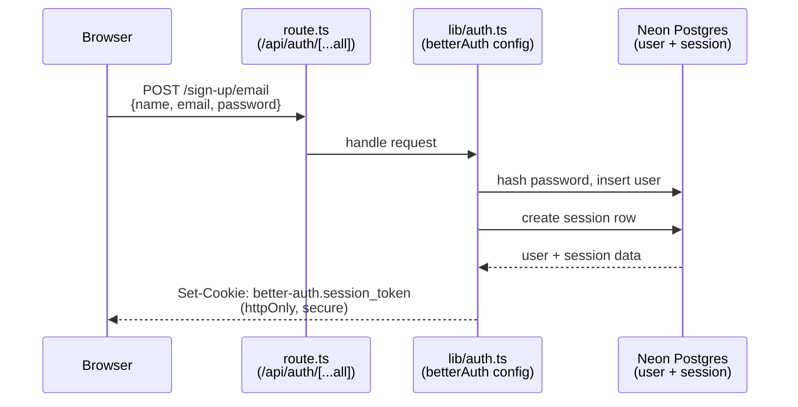
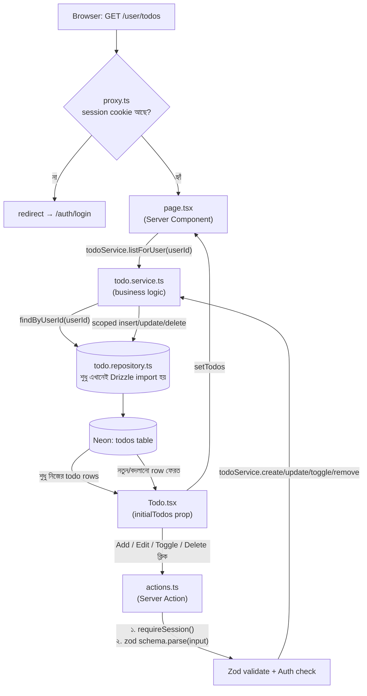

# 🧭 Todo App Playbook

তোমার Todo প্রজেক্টে Auth (Better Auth), Database (Drizzle + Neon Postgres), Server Actions, Admin Authorization, আর এখন একটা layered architecture (Zod + Service + Repository) ও automated test (Vitest) যোগ হয়েছে। এই ডকুমেন্টে আছে — কোন ফাইল কী কাজ করে, ডেটা কীভাবে প্রবাহিত হয় (Mermaid diagram সহ), আর প্রতিটা feature নিজে হাতে কীভাবে test করবে।

**Stack:** Next.js App Router · Better Auth · Drizzle ORM · Neon Postgres · Server Actions · Zod · Vitest + Testing Library

---

## ১. কী বানানো হয়েছে

শুরুতে todos শুধু browser-এর memory-তে (`useState`) থাকত — reload দিলেই হারিয়ে যেত, আর কোনো "user" ধারণাই ছিল না। এখন:

- ✅ প্রতিটা user নিজের email/password দিয়ে **Register** ও **Login** করতে পারে (Better Auth)
- ✅ Todo এখন সত্যিকারের database-এ (Neon Postgres) সংরক্ষিত হয় — reload দিলে হারায় না
- ✅ একজন user শুধু **নিজের** todo দেখতে/বদলাতে পারবে, অন্য কারো না
- ✅ `/user/*` ও `/admin/*` route শুধু login করা থাকলেই খোলে, আর Admin route শুধু admin role-এর জন্য
- ✅ প্রতিটা Server Action-এ ঢোকা data এখন **Zod** দিয়ে validate হয়, DB পর্যন্ত ভুল data পৌঁছায় না
- ✅ Code এখন একটা পরিষ্কার **layered architecture**-এ ভাগ করা (Action → Service → Repository) — একসাথে গুলিয়ে থাকা logic এখন আলাদা আলাদা দায়িত্বে ভাগ করা
- ✅ **Automated test** (Vitest + Testing Library) আছে যা প্রতিবার code বদলালে স্বয়ংক্রিয়ভাবে check করে কিছু ভেঙেছে কিনা

---

## ২. সিস্টেম Flow

### ছবি ১ — Login/Register কীভাবে Session Cookie বানায়



> এই cookie-ই পরের প্রতিটা request-এ প্রমাণ করে "তুমি কে"। `role: "user"` ডিফল্ট হিসেবে বসে (admin plugin-এর কাজ)।

### ছবি ২ — Todo Page কীভাবে DB থেকে Data আনে ও বদলায় (Layered Architecture সহ)



> এখানেই আসল নিরাপত্তা: প্রতিটা DB query-তে `userId` দিয়ে scope করা থাকে (Repository-তে) — login করা মানেই না যে সবার todo access করা যাবে। আর প্রতিটা write-এর আগে Zod দিয়ে data shape validate হয় (Action-এ) — ভুল/অতিরিক্ত বড় data DB পর্যন্ত পৌঁছায়ই না।

---

## ৩. Layered Architecture — কেন এভাবে ভাগ করা হয়েছে

```
UI (Todo.tsx)  →  Server Action (actions.ts)  →  Zod + Auth check  →  Service  →  Repository  →  DB
```

| Layer | ফাইল | দায়িত্ব |
|---|---|---|
| **Validation** | `lib/validations/todo.ts` | Input-এর shape/size ঠিক আছে কিনা — একমাত্র সত্যের উৎস (single source of truth) |
| **Repository** | `lib/repositories/todo.repository.ts` | শুধু DB-র সাথে কথা বলা (Drizzle query) — **এটাই একমাত্র ফাইল যেখানে `db` সরাসরি import হয়** |
| **Service** | `lib/services/todo.service.ts` | Business logic — DB row-কে UI-এর জন্য উপযুক্ত shape-এ (TodoType) রূপান্তর করা |
| **Server Action** | `actions.ts` | পাতলা (thin) — session check → Zod parse → Service কল → `revalidatePath` |

**কেন এই ভাগাভাগি লাভজনক (আগে সবকিছু `actions.ts`-এ মেশানো ছিল):**
- Repository বদলালেও (ধরো Postgres থেকে অন্য DB-তে যাওয়া লাগলে) Service/Action-এর কিছু বদলাতে হয় না
- Service-কে আলাদাভাবে test করা যায় (নিচে দেখো), আসল database ছাড়াই
- প্রতিটা ফাইল ছোট ও একটাই কাজ করে — পড়তে/বুঝতে সহজ

---

## ৪. ফাইল রেফারেন্স — কোনটা কী কাজ করে

🟢 = নতুন ফাইল · 🟠 = বদলানো ফাইল

| ফাইল | কাজ |
|---|---|
| `.env.local` | 🟠 সব secret এখানে — `DATABASE_URL`, `BETTER_AUTH_SECRET`, `BETTER_AUTH_URL`, `PASETO_LOCAL_KEY`, আর optional external API key |
| `drizzle.config.ts` | 🟠 drizzle-kit কে বলে দেয় কোন schema file (todos + auth) থেকে migration বানাতে হবে |
| `app/db/auth-schema.ts` | 🟢 Better Auth CLI-generated — `user`, `session`, `account`, `verification` টেবিল |
| `app/db/schema.ts` | 🟠 `todos` টেবিলে `userId` foreign key যোগ হয়েছে — কার todo সেটা track করার জন্য |
| `app/db/index.ts` | 🟠 Drizzle client, দুই schema (auth + todos) একসাথে wire করা |
| `lib/auth.ts` | 🟠 Better Auth-এর মূল server config — email/password, admin plugin, DB adapter |
| `lib/auth-client.ts` | 🟢 Browser থেকে ব্যবহারের জন্য — `useSession`, `signIn`, `signUp`, `signOut` |
| `lib/auth-helpers.ts` | 🟢 `requireSession()`/`requireUserId()` — Server Action/Page থেকে session read করার জন্য একটাই জায়গা (আগে duplicate ছিল) |
| `lib/env.ts` | 🟢 Zod দিয়ে required env var check করে; optional external service (OpenAI/S3/…) configured কিনা জানানোর জন্য `isXConfigured()` helper |
| `lib/validations/todo.ts` | 🟢 Zod schema — `createTodoSchema`, `updateTodoSchema`, `todoIdSchema` |
| `lib/repositories/todo.repository.ts` | 🟢 শুধুমাত্র এই ফাইল Drizzle দিয়ে সরাসরি `todos` টেবিল ছোঁয় |
| `lib/services/todo.service.ts` | 🟢 Repository-কে wrap করে, DB row-কে `TodoType`-এ রূপান্তর করে |
| `app/api/auth/[...all]/route.ts` | 🟢 Better Auth-এর সব request (login/register/session) এখানে এসে পড়ে |
| `app/(public)/auth/login/page.tsx` | 🟠 এখন real `signIn.email()` কল করে, loading state + error toast সহ |
| `app/(public)/auth/registration/page.tsx` | 🟠 এখন real `signUp.email()` কল করে |
| `proxy.ts` | 🟢 `/user/*` ও `/admin/*`-এ ঢোকার আগে session cookie চেক করে, না থাকলে login-এ পাঠায় |
| `components/shared/Navbar.tsx` | 🟠 Hardcoded state বাদ, এখন real `useSession()` দিয়ে Login/Dashboard/Log-out দেখায়, Log out-এর পর সরাসরি redirect করে |
| `app/(private)/user/todos/page.tsx` | 🟠 Server Component — এখন সরাসরি DB না ছুঁয়ে `todoService.listForUser()` কল করে |
| `app/(private)/user/todos/actions.ts` | 🟠 এখন পাতলা: `requireUserId()` → Zod parse → `todoService.xxx()` → `revalidatePath` |
| `components/todo/Todo.tsx` | 🟠 DB থেকে seed হয়, action-গুলো এখন object নেয় (যেমন `createTodo({ title, body })`) |
| `types/todo.ts` | 🟠 `id: number` থেকে `id: string` (Postgres uuid-এর জন্য) |
| `app/(private)/admin/overview/page.tsx` | 🟠 Server-side role check — admin না হলে `/user/todos`-এ redirect |
| `app/(private)/admin/users/page.tsx` | 🟠 একই guard, প্লাস `auth.api.listUsers()` দিয়ে সব user-এর টেবিল |
| `vitest.config.ts` / `vitest.setup.ts` | 🟢 Test চালানোর configuration (jsdom environment, `@testing-library/jest-dom`, DOM cleanup) |
| `lib/validations/todo.test.ts` | 🟢 Zod schema-র edge case test |
| `lib/services/todo.service.test.ts` | 🟢 Service layer-এর test (Repository mock করে, আসল DB ছাড়াই) |
| `components/todo/TodoForm.test.tsx` | 🟢 Testing Library দিয়ে form-এর আচরণ test |

---

## ৫. ধাপে ধাপে টেস্ট করো (Manual, Browser-এ)

টার্মিনালে `npm run dev` চালিয়ে `http://localhost:3000` খোলো, তারপর নিচের ধাপগুলো একে একে করো।

### ক) Auth টেস্ট

1. **Register** — `/auth/registration`-এ গিয়ে নাম/ইমেইল/পাসওয়ার্ড দিয়ে ফর্ম জমা দাও।
   ✅ "Registration successful!" toast দেখাবে, আর automatically `/user/todos`-এ চলে যাবে।

2. **Navbar চেক** — উপরে তাকাও।
   ✅ এখন আর "Login/Register" দেখাচ্ছে না — "Dashboard" আর "Log out" বাটন দেখাবে (কারণ `useSession()` এখন real session পেয়েছে)।

3. **Log out** করে আবার **Log In** করো — একই ইমেইল/পাসওয়ার্ড দিয়ে।
   ✅ "Logged in successfully!" এবং আবার `/user/todos`-এ redirect। Log out করলেই সাথে সাথে `/auth/login`-এ redirect হবে (refresh লাগবে না)।

4. **ভুল পাসওয়ার্ড** দিয়ে Login করার চেষ্টা করো।
   ✅ Red error toast দেখাবে ("Invalid email or password"), redirect হবে না — কোনো crash হবে না।

5. **Route protection** — Log out করে সরাসরি browser URL bar-এ `localhost:3000/user/todos` টাইপ করো।
   ✅ Todo page দেখার সুযোগই পাবে না — সাথে সাথে `/auth/login`-এ redirect হয়ে যাবে (এটা `proxy.ts`-এর কাজ)।

### খ) Todo CRUD টেস্ট

Login করা অবস্থায় `/user/todos` পেজে থেকে:

1. একটা todo **Add** করো (title + optional details)।
   ✅ সাথে সাথে লিস্টে দেখাবে — form খালি হয়ে যাবে। খুব ছোট (খালি) title দিয়ে submit করার চেষ্টা করলে কিছুই হবে না — Zod ও form validation দুই জায়গাতেই আটকায়।

2. Checkbox-এ ক্লিক করে **Toggle Complete** করো।
   ✅ টাইটেলের উপর দিয়ে লাইন কেটে যাবে (line-through)।

3. পেন্সিল আইকনে ক্লিক করে **Edit** করো, title/body বদলে Save দাও।
   ✅ Dialog বন্ধ হয়ে যাবে, লিস্টে নতুন title/body দেখাবে।

4. সবচেয়ে গুরুত্বপূর্ণ টেস্ট — **Page reload (F5)** করো।
   ✅ Todo হারায়নি! কারণ এখন সেটা database-এ আছে, browser memory-তে না।

5. Trash আইকনে ক্লিক করে **Delete** করো, confirmation dialog-এ "Delete" চাপো।
   ✅ লিস্ট থেকে চিরতরে চলে যাবে (reload দিলেও আর ফিরবে না)।

6. **User isolation টেস্ট** — একটা Incognito window খুলে দ্বিতীয় একটা account দিয়ে Register করো, একটা আলাদা todo Add করো।
   ✅ প্রথম account-এ ফিরে গেলে দ্বিতীয় user-এর todo দেখতে পাবে না — প্রতিটা query `userId` দিয়ে scoped বলে।

### গ) Admin Authorization টেস্ট

1. Normal user দিয়ে login করা অবস্থায় সরাসরি `/admin/overview` URL-এ যাও।
   ✅ ভেতরে ঢুকতে পারবে না — `/user/todos`-এ ফেরত পাঠাবে (server-side role check)।

2. নিজেকে admin বানাও — নিচের "Drizzle Studio" সেকশন দেখে `user` টেবিলে নিজের row-এর `role` কলাম `"admin"` করে দাও।
   ✅ এখন Navbar-এ "Dashboard" লিংক `/admin/overview`-এ যাবে (আগে ছিল `/user/profile`)।

3. `/admin/users`-এ যাও।
   ✅ সব registered user-এর নাম/ইমেইল/role-এর একটা টেবিল দেখাবে।

---

## ৬. Automated Test চালাও (Terminal-এ, Browser ছাড়াই)

```bash
npm run test          # একবার চালিয়ে ফলাফল দেখায়
npm run test:watch    # ফাইল বদলালেই আবার চলে (লেখার সময় ব্যবহার করো)
```

**এখন যা test হচ্ছে (১৩টা test, ৩টা file):**

| Test file | কী check করে |
|---|---|
| `lib/validations/todo.test.ts` | খালি title reject হয়, ২০০ char-এর বেশি title reject হয়, whitespace ঠিকমতো trim হয়, `todoIdSchema` ভুল uuid reject করে |
| `lib/services/todo.service.test.ts` | Service সঠিকভাবে Repository কল করছে কিনা, DB-র `null` body → UI-র `undefined`-এ রূপান্তর ঠিকমতো হচ্ছে কিনা — **আসল database ছাড়াই**, Repository mock করে |
| `components/todo/TodoForm.test.tsx` | Form-এ টাইপ করে Add চাপলে সঠিক (trimmed) data দিয়ে callback call হয় কিনা, খালি title-এ submit আটকায় কিনা |

**কেন গুরুত্বপূর্ণ:** এই test গুলো লিখতে গিয়েই ২টা real bug ধরা পড়েছিল — একটা test fixture-এ ভুল uuid ব্যবহার হয়েছিল (Zod সঠিকভাবেই ধরেছে), আর Testing Library-র automatic cleanup ঠিকমতো wire করা ছিল না (একই test file-এর ভেতরের test একে অপরের সাথে মিশে যাচ্ছিল)। এটাই automated test-এর আসল সুবিধা — চোখে না পড়া bug সামনে নিয়ে আসে।

---

## ৭. বোনাস: Drizzle Studio দিয়ে DB সরাসরি দেখো

```bash
npm run db:studio
```

এটা browser-এ একটা visual database explorer খুলে দেবে (`local.drizzle.studio`)। বাম পাশে `user`, `session`, `todos` টেবিল দেখবে — যা কিছু test করছ, সেটা এখানে live change হতে দেখতে পাবে। এখান থেকেই কোনো user-এর `role` সেল-এ ক্লিক করে `"admin"` লিখে বদলে দিতে পারবে।

---

## ৮. টেস্ট করতে গিয়ে আটকালে

**Login/Register করলে কিছুই হচ্ছে না, console-এ error**
`.env.local` চেক করো — `DATABASE_URL`, `BETTER_AUTH_SECRET`, `BETTER_AUTH_URL`, `PASETO_LOCAL_KEY` থাকতে হবে। dev server restart করে দেখো (env বদলালে restart লাগে)।

**Todo add করলে toast-এ "Could not add todo" দেখাচ্ছে**
Session expire হয়ে থাকতে পারে — একবার Log out করে আবার Log in করো। এখনো সমস্যা হলে terminal-এ dev server-এর log দেখো, actual database error সেখানে দেখাবে।

**Admin page-এ ঢুকতে পারছি না, role admin করার পরেও**
Drizzle Studio-তে সঠিক row বদলেছ কিনা check করো (ইমেইল মিলিয়ে দেখো)। তারপর একবার Log out → Log in করো, কারণ session-এর সাথে role তথ্য জড়ানো থাকে।

**`npm run db:migrate` করলে "url: undefined" error**
`drizzle.config.ts`-এ env load ঠিকমতো `.env.local` থেকে হচ্ছে কিনা দেখো।

**`npm run test` চালালে "Cannot find module '@/...'" error**
`vitest.config.ts`-এ `@` alias ঠিকমতো `resolve.alias`-এ সেট আছে কিনা দেখো — এটা `tsconfig.json`-এর path alias-এর থেকে আলাদাভাবে configure করতে হয় (Vitest, TypeScript-এর tsconfig automatically পড়ে না)।

**`npm run test` চালালে একই test file-এর ভেতরের test একে অপরের সাথে মিশে যাচ্ছে**
`vitest.setup.ts`-এ `afterEach(() => cleanup())` আছে কিনা check করো — এটা ছাড়া প্রতিটা `render()`-এর DOM আগেরটার সাথে জমা হতে থাকে।

---

*তোমার নিজের শেখার progress track করার জন্য বানানো — যেকোনো ধাপে আটকালে জিজ্ঞেস করো।*
