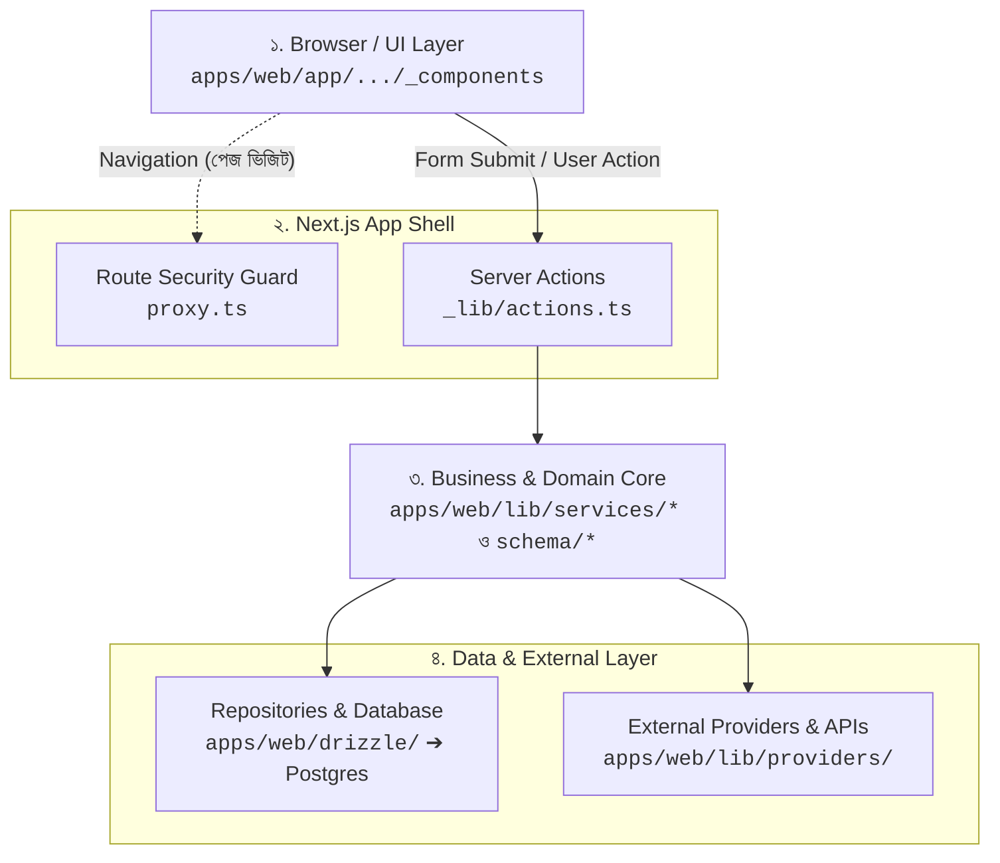
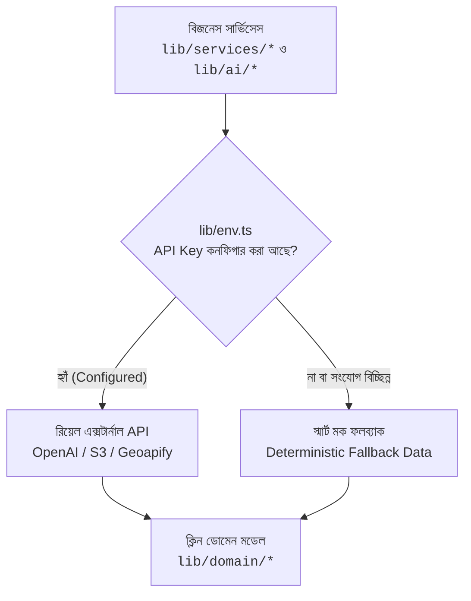

# সিস্টেম আর্কিটেকচার ওভারভিউ (Architecture Overview & System Topology)

এই Todo অ্যাপ্লিকেশনটি মূলত এন্টারপ্রাইজ গ্রেড **MEO Tool মনোরেপো আর্কিটেকচার**-এর একটি সহজবোধ্য ও বাস্তবমুখী প্রতিরূপ (Blueprint)। একজন বিগিনার ডেভেলপার যেন বুঝতে পারেন কীভাবে বড় বড় প্রজেক্টে টাইপ-সেফটি, রুট-লোকাল অর্গানাইজেশন, সার্ভিস-রিপোজিটরি প্যাটার্ন এবং এক্সটার্নাল সার্ভিস আইসোলেশন পরিচালনা করা হয়।

---

## 🏛️ আর্কিটেকচার ডায়াগ্রামসমূহ (Architecture Diagrams)

সহজে ও পরিষ্কারভাবে সিস্টেমের গঠন ও ডেটা প্রবাহ বোঝার জন্য নিচে ৩টি সুস্পষ্ট ডায়াগ্রাম দেওয়া হলো:

### ১. High-Level Architecture (মূল লেয়ারসমূহের সামগ্রিক স্তর)

> **ব্যাখ্যা:**  
> - **Browser/UI Layer:** ইউজার ব্রাউজারে ইন্টারঅ্যাক্ট করেন। পেজ পরিবর্তনের সময় `proxy.ts` রুট গার্ড সেশন যাচাই করে।
> - **Next.js App Shell:** ব্যবহারকারীর ফর্ম সাবমিশনগুলো সার্ভার অ্যাকশনে আসে।
> - **Business/Domain Core:** ইনপুট ভ্যালিডেশন এবং মূল বিজনেস লজিক প্রক্রিয়াজাত করে।
> - **Data & External Providers:** ডেটাবেস অপারেশন এবং থার্ড-পার্টি API (OpenAI, S3, Maps) কলগুলো হ্যান্ডেল করে।

---

### ২. Todo Request Flow (রিকোয়েস্ট ও ডেটা প্রবাহের পূর্ণাঙ্গ চক্র)

```mermaid
flowchart LR
    UI["UI Component<br/><code>TodoForm.tsx</code>"]
    Action["Server Action<br/><code>actions.ts</code>"]
    Zod["Zod Validation<br/><code>schema/todo.ts</code>"]
    Auth["Auth Check<br/><code>requireUserId()</code>"]
    Service["Domain Service<br/><code>todo.service.ts</code>"]
    Repo["Repository<br/><code>todo.repository.ts</code>"]
    DB[("PostgreSQL<br/><code>todos table</code>")]

    UI -->|"১. Submit"| Action
    Action -->|"২. Validate"| Zod
    Zod -->|"৩. Verify Session"| Auth
    Auth -->|"৪. Business Logic"| Service
    Service -->|"৫. SQL Query"| Repo
    Repo -->|"৬. INSERT / UPDATE"| DB
```

> **ব্যাখ্যা:**  
> ১. ইউজার ফর্ম সাবমিট করলে Server Action কল হয়।  
> ২. Zod স্কিমা ইনপুটের আকার ও টাইপ যাচাই করে।  
> ৩. `requireUserId()` সেশন থেকে ইউজারের পরিচয় নিশ্চিত করে।  
> ৪. Domain Service বিজনেস লজিক ও ডেটা রূপান্তর পরিচালনা করে।  
> ৫. Repository কুয়েরিতে ইউজারের `userId` বাধ্যতামূলকভাবে ফিল্টার করে PostgreSQL ডাটাবেসে সেভ করে।

---

### ৩. External Provider Flow (এক্সটার্নাল সার্ভিস ও স্মার্ট ফলব্যাক)

> **ব্যাখ্যা:**  
> কোনো সার্ভিসে থার্ড-পার্টি API প্রয়োজন হলে প্রথমে `lib/env.ts` চেক করে। API Key অনুপস্থিত বা নেটওয়ার্ক ফেইল করলেও অ্যাপ কখনো ক্র্যাশ করে না; বরং বুদ্ধিমান মক ডেটা দিয়ে ফ্রন্টএন্ডে ক্লিন ডোমেন মডেল রিটার্ন করে।

---

## 🔑 আর্কিটেকচারের ৪টি অলঙ্ঘনীয় মূল নীতি (Core Invariants)

1. **একমুখী নির্ভরতা প্রবাহ (Unidirectional Dependency Flow):**  
   UI → Server Action → Service → Repository → Database। ডাটাবেসের কোয়েরি কোড কখনো UI বা সার্ভিসে ছড়াবে না।
2. **ডাটা আইসোলেশন (Tenant Isolation by Construction):**  
   প্রতিটি রিপোজিটরি অপারেশনে বাধ্যতামূলকভাবে `userId` যাচাই করা হয়, যাতে একজন ইউজারের ডেটা অন্য কেউ দেখতে না পারে।
3. **জিরো-ক্র্যাশ গ্যারান্টি (Graceful Fallbacks):**  
   সব এক্সটার্নাল ডিপেন্ডেন্সির জন্য ফলব্যাক ব্যবস্থা বিদ্যমান, যা স্থানীয় উন্নয়ন ও টেস্টকে বাধাহীন করে।
4. **স্কেল-উপযোগী গঠন (Scale-Appropriate Structure, Over-Engineering নয়):**  
   একটা মাত্র ফাইলের জন্য আলাদা subfolder (`schema/`, `tests/`, `drizzle/`) তৈরি করা হয় না — flat কাঠামোই ডিফল্ট। নতুন abstraction (layer, wrapper সার্ভিস, প্যাকেজ) তখনই যোগ হয় যখন তার আসল consumer/caller থাকে; কোনো future use-case অনুমান করে আগে থেকে বানানো হয় না। `packages/*` তাই খালি থাকে যতক্ষণ না দ্বিতীয় কোনো app সত্যিই শেয়ার্ড কোড দাবি করে।
