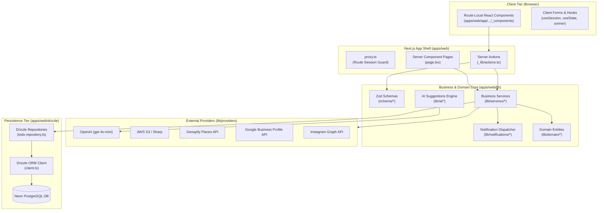

# Architecture Overview & System Topology

The Todo application serves as an educational blueprint of the office **MEO Tool monorepo architecture**. It demonstrates how enterprise-grade scalability, type safety, route locality, and provider isolation can be applied in Next.js App Router applications.

## Core Architectural Invariants

1. **Unidirectional Dependency Flow**:
   - UI / Components depend on Server Actions or Services.
   - Server Actions depend on Zod validation and Services.
   - Services depend on Repositories and Providers.
   - Repositories depend on Drizzle ORM and Database schemas.
   - **Crucial Rule**: DB logic never leaks into UI, and UI logic never leaks into Services.

2. **Tenant Isolation by Construction**:
   - Every read and write operation executed against user resources (`todos`, `uploads`) requires a valid `userId`.
   - The repository explicitly binds the user ID into the SQL `WHERE` clause.

3. **Graceful Fallbacks**:
   - All third-party providers (AI, Maps, S3, Meta) implement intelligent fallbacks when API keys are absent, ensuring that developers can test and evaluate the system without third-party vendor dependencies.
