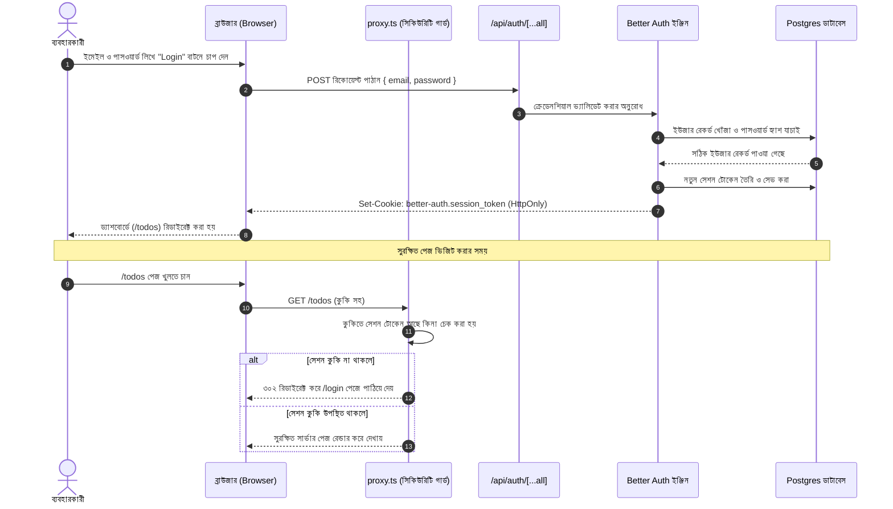
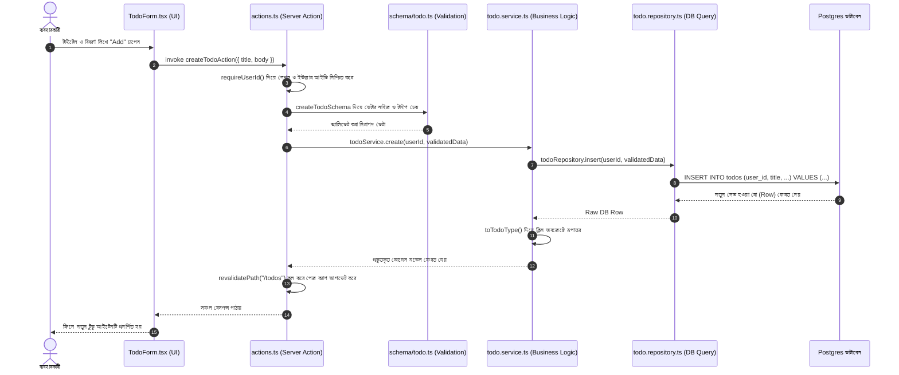
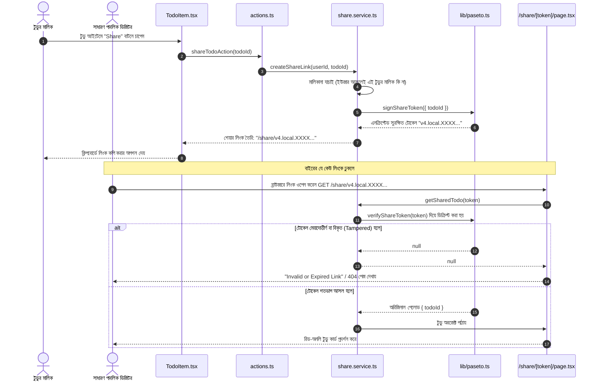

# সিস্টেমের সিকোয়েন্স ফ্লো (System Sequence Flows)

এই ডকুমেন্টে অ্যাপ্লিকেশনের তিনটি সবচেয়ে গুরুত্বপূর্ণ কাজের পর্যায়ক্রমিক প্রবাহ (Step-by-Step Sequence Flow) সহজ ডায়াগ্রাম ও ব্যাখ্যাসহ দেওয়া হলো।

---

## ১. অথেনটিকেশন ও সুরক্ষিত রুট অ্যাক্সেস (Authentication & Route Guard)

ব্যবহারকারী কীভাবে লগইন করেন এবং লগইন ছাড়া কেউ সুরক্ষিত পেজে যেতে চাইলে সিস্টেম কীভাবে তা প্রতিহত করে:

---

## ২. টুডু তৈরি ও ভ্যালিডেশন লাইফসাইকেল (Todo Creation & Lifecycle)

একটি নতুন টুডু ইনপুট দেওয়ার পর কীভাবে সেটি ডাটাবেসে সেভ হয়ে স্ক্রিনে আসে:

---

## ৩. PASETO ক্রিপ্টোগ্রাফিক শেয়ারিং প্রবাহ (PASETO Share Flow)

ডাটাবেসে কোনো অতিরিক্ত শেয়ার টেবিল ছাড়াই কীভাবে নিরাপদে টুডু বাইরের বন্ধুদের সাথে শেয়ার করা যায়:

