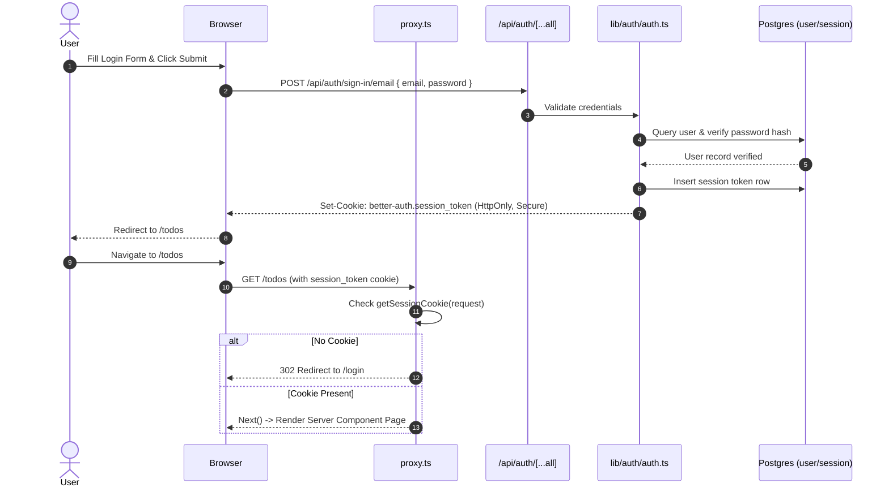
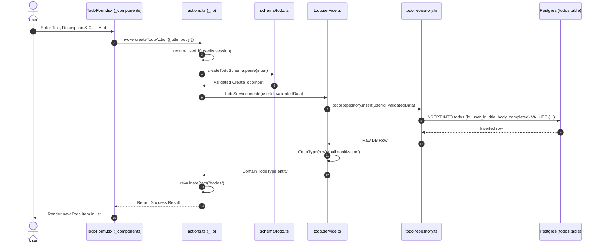
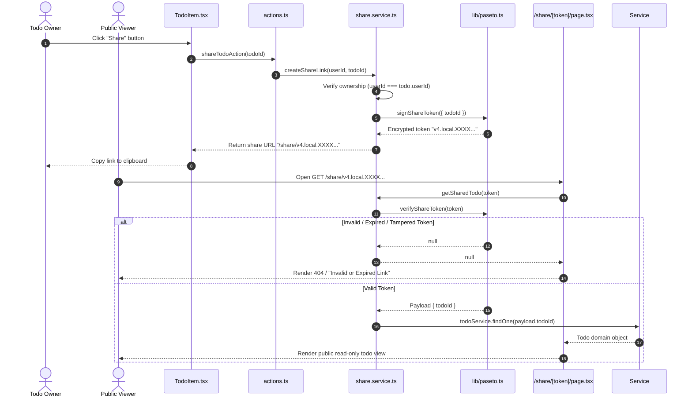

# System Sequence Flows

This document details key operational sequence flows through the layered architecture.

## 1. Authentication & Protected Route Access

## 2. Todo Creation & Validation Lifecycle

## 3. PASETO Cryptographic Share Flow

